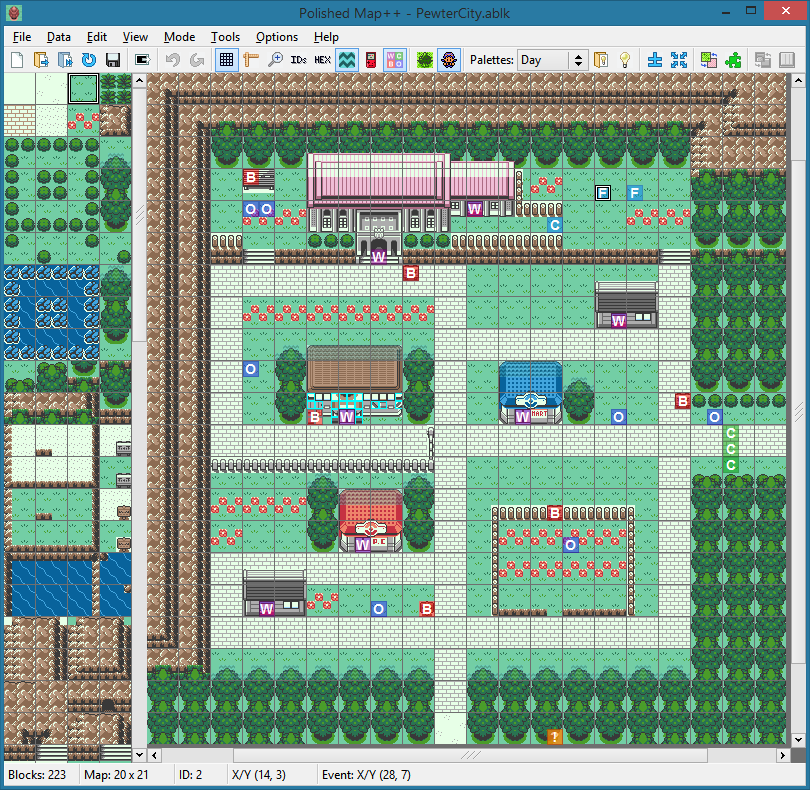

# Polished Map 

A map and tileset editor for [pokecrystal](https://github.com/pret/pokecrystal), [pokered](https://github.com/pret/pokered), and hacks including [Polished Crystal v2](https://github.com/Rangi42/polishedcrystal/tree/v2.2.0), [Red++ v3](https://github.com/TheFakeMateo/rpp-backup), [Orange](https://github.com/PiaCarrot/pokeorange), [Prism](https://www.reddit.com/r/PokemonPrism), and many more.

Inspired by [crowdmap](https://github.com/yenatch/crowdmap), but implemented with C++ and [FLTK](http://www.fltk.org/), and with more functions for graphics editing.

Latest release: [**4.5.1**](https://github.com/Rangi42/polished-map/releases/tag/v4.5.1)

Follow the steps in [INSTALL.md](INSTALL.md) to install the release copy of Polished Map, or the longer instructions to build it yourself from source.

The [example/](example/) directory contains a minimal pokecrystal project with two test maps. **Kanto.180x135.kanto.blk** is a stitch of every Kanto overworld map (they all use the `kanto` tileset). **Johto.235x135.johto.blk** is a stitch of every Johto overworld map; Goldenrod and Azalea use the `johto_modern` tileset, so try switching tilesets with **Edit→Change Tileset…** or by pressing Ctrl+H.

Browse the menu items, toolbar buttons, and Help dialog to learn how to use Polished Map. And don't miss the mouse controls:

|                      | Blocks Mode   | Events Mode      | Edit Block      | Edit Tileset |
|----------------------|---------------|------------------|-----------------|--------------|
| **Click/drag**       | Place block   | Move event       | Place tile      | Place pixel  |
| **Middle drag**      | Scroll        | Scroll           |                 |              |
| **Right-click**      | Select block  | Edit event       | Select tile     | Select hue   |
| **Double-click**     |               | Open .asm file   |                 |              |
| **Ctrl+click**       | Replace block |                  | Place 2x2 tiles | Replace hue  |
| **Shift+click**      | Flood fill    | Folow warp event |                 | Flood fill   |
| **Ctrl+Shift+click** |               |                  | Place 4x4 tiles |              |
| **Alt+click**        | Swap blocks   |                  |                 | Swap hues    |

More information is at the [Skeetendo Forums](https://hax.iimarckus.org/topic/7222/) or [PokéCommunity](https://www.pokecommunity.com/showthread.php?t=425994). If you have questions or comments, please go there.

