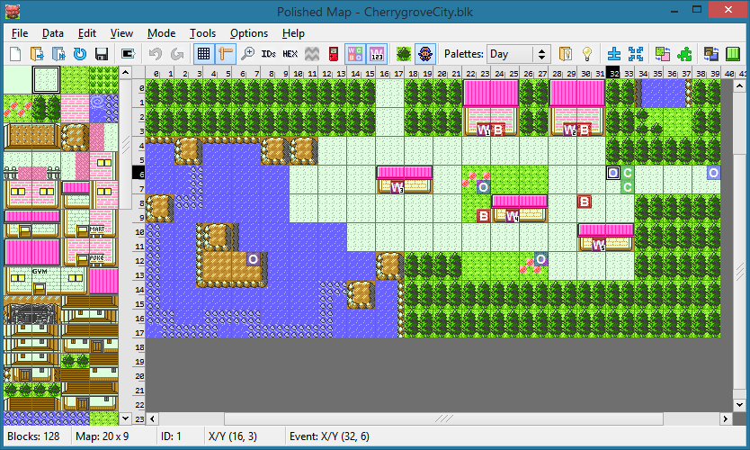

# Polished Map

A map and tileset editor for [pokecrystal](https://github.com/pret/pokecrystal), [pokered](https://github.com/pret/pokered), and hacks including [Polished Crystal](https://github.com/Rangi42/polishedcrystal), [Orange](https://github.com/PiaCarrot/pokeorange), [Red++](https://github.com/TheFakeMateo/RedPlusPlus/), [Prism](https://www.reddit.com/r/PokemonPrism/), and [Axyllia](http://pokemonfractal.wikia.com/wiki/Axyllia).

Inspired by [crowdmap](https://github.com/yenatch/crowdmap), but implemented with C++ and [FLTK](http://www.fltk.org/), and focused on graphics instead of script editing.

Latest release: [**3.5.1**](https://github.com/Rangi42/polished-map/releases/tag/v3.5.1)

Follow the steps in [INSTALL.md](INSTALL.md) to install the release copy of Polished Map, or the longer instructions to build it yourself from source.

The [example/](example/) directory contains a minimal pokecrystal project with two test maps. **Kanto.180x135.kanto.blk** is a stitch of every Kanto overworld map (they all use the "kanto" tileset). **Johto.235x135.johto.blk** is a stitch of every Johto overworld map; Goldenrod and Azalea use the johto_modern tileset, so try switching tilesets with **Edit→Change Tileset…** or by pressing Ctrl+H.

More information is at the [Skeetendo Forums](https://hax.iimarckus.org/topic/7222/). If you have questions or comments, please go there.

