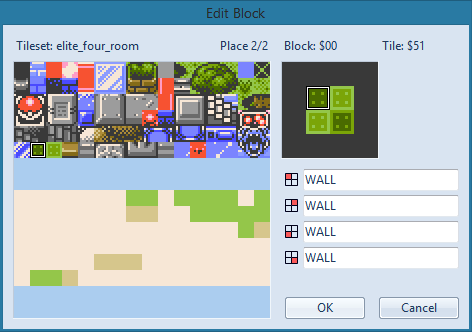

# Edit Block

The [README](../README.md) and Help menu summarize some functions of Polished Map that involve clicking while holding the Ctrl/Alt/Shift keys. These functions are rather complicated in the block editor, so they're illustrated here.

## Click: single tile

Simply left-click to place a single tile.

## Ctrl+click: 2x2 contiguous tiles

Hold Ctrl and left-click to place a contiguous 2x2 square.

## Ctrl+Shift+click: 4x4 contiguous tiles

Hold Ctrl+Shift and left-click to place a contiguous 4x4 square.

## Alt+click: 2+2 sequential tiles

Hold Alt and left-click to place a sequential 2+2 line in a 2x2 square.

## Alt+Shift+click: 4+4+4+4 sequential tiles

Hold Alt+Shift and left-click to place a sequential 4+4+4+4 line in a 4x4 square.

## Ctrl+Alt+click: 2-2 sequential tiles

Hold Ctrl+Alt and left-click to place a sequential 2-2 line in a 2x2 square, with the rows going backwards.

## Ctrl+Alt+Shift+click: 4-4-4-4 sequential tiles

Hold Ctrl+Alt+Shift and left-click to place a sequential 4-4-4-4 line in a 4x4 square, with the rows going backwards.

## Shift+click: 2/2 checkerboard tiles

Hold Shift and left-click to place two sequential tiles in a 2x2 square, with an alternating checkerboard pattern.

